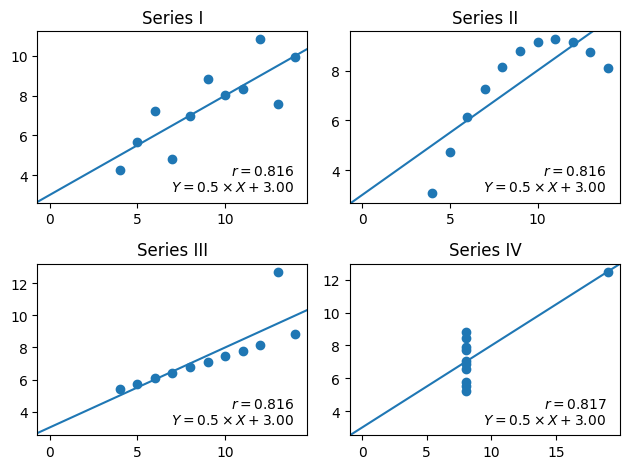

# Anscombe's Quartet

The raw data has four series. The correlation coefficients are high.
Visualization shows that a simple linear regression model is misleading.

## Raw Data for the Series

The source file has four series, identified as `I`, `II`, `III`, and `IV`.

Each series has 11 $(x, y)$ sample pairs.


```python
%run recipe_05_core.ipynb
```

## Statistical Computations

Two properties compute correlation coefficient, $r$, and perform linear regression.
The regression gives us two parameters for a line.
- Slope, $m$.
- Intercept, $b$.

The equation for a line is $y = m \times x + b$


```python
from IPython.display import display, Markdown
m = Markdown(rf"""
We can see that $r = {quartet['I'].correlation:.2f}$; this is a strong correlation.

This leads to a linear regression result with $y = {r.slope:.1f} \times x + {r.intercept:.1f}$ as the best fit
for this collection of samples.
Interestingly, this is true for all four series in spite of the dramatically distinct scatter plots.
""")
display(m)
```


We can see that $r = 0.82$; this is a strong correlation.

This leads to a linear regression result with $y = 0.5 \times x + 3.0$ as the best fit
for this collection of samples.
Interestingly, this is true for all four series in spite of the dramatically distinct scatter plots.


## Visualization

The following figures show the four series.


```python
from matplotlib import pyplot as plt
```


```python
fig = plt.figure(layout='tight')
ax_dict = fig.subplot_mosaic(
    [
        ["I", "II"],
        ["III", "IV"],
    ],
)
for name, ax in ax_dict.items():
    series = quartet[name]
    ax.scatter(series.x, series.y)
    ax.set_title(f"Series {name}")
    lr = series.regression
    eq1 = rf"$r = {series.correlation:.3f}$"
    eq2 = rf"$Y = {lr.slope:.1f} \times X + {lr.intercept:.2f}$"
    ax.text(.95, .05, f"{eq1}\n{eq2}",
            fontfamily='sans-serif',
            horizontalalignment='right', verticalalignment='bottom', transform=ax.transAxes)
    ax.axline((0, lr.intercept), slope=lr.slope)
plt.show()
```


    

    


```python

```
